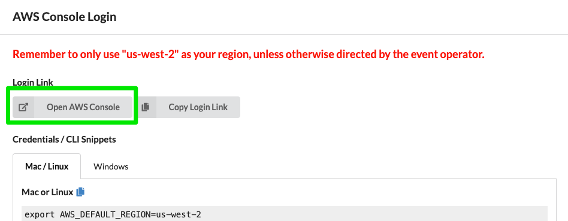

# Steps to access EKS cluster
## Login into AWS console from the Event Engine dashboard
You are encouraged to use the Firefox web browser. It is because pasting from clipboard into the required web terminal may not work in later steps.


Remeber to only use "us-west-2" as your region


Select EC2 from Management Console and select Instances (running). You should see a EC2 instance called SplunkWorkshop-box


Now select SplunkWorkshop instance and select connect


## Verify EKS cluster
Select EC2 Instance Connect tab and click connect. This will open an SSH session to the EC2 instance. Once the instance is opened check the running EKS cluster. You should see a cluster named

```
eksctl get cluster
```

### Update Kubectl
```
aws eks --region us-west-2 update-kubeconfig --name eksworkshop-eksctl 
```
### Test Kubectl
```
kubectl get nodes
```
If we see our 2 nodes, we know we have authenticated correctly
### Install Helm 3
```
curl -fsSL -o get_helm.sh https://raw.githubusercontent.com/helm/helm/master/scripts/get-helm-3

chmod 700 get_helm.sh
./get_helm.sh

```

### Get Workshop content
``` 
wget https://github.com/splunk/imt-workshop/archive/refs/heads/master.zip
unzip master.zip
mv imt-workshop-master workshop
```
