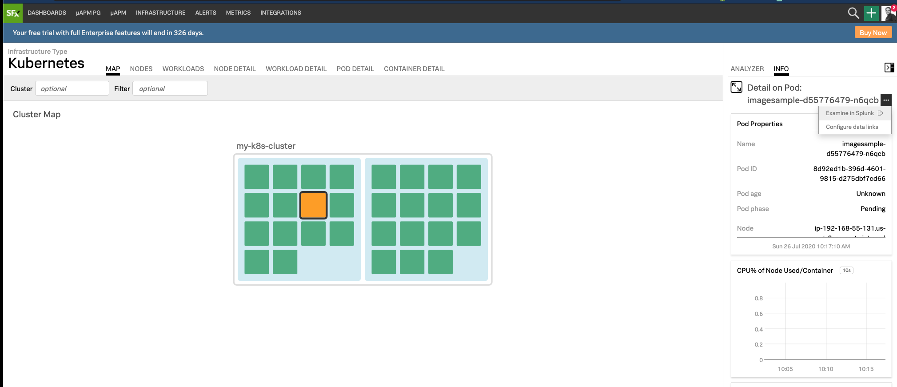

# Integration with Splunk

## 1. Introduction to Data links

Data Links allow you to create dynamic links on properties that appear in a chart’s data table and in list charts. Once enable this allows you to swiftly jump into external systems or SignalFx dashboards.

## 2. Configuring an integration with Splunk

Goto **Settings → Organizations Settings → Global Data Links** and click on **New Link**{: .label-button .sfx-ui-button}

{: .zoom}

Here you will need to provide a **Link Label** e.g. Examine in Splunk. For the **Link to** use the dropdown and select **Custom URL**.

For **Trigger** there are 3 possible options:

* _Any Metadata value_ - To display your link next to every property and every property value in a chart, select Any Metadata Value.
* _Any Value of_ - To display your link next to a specified property type, select Any Value of.
* _Property:Value Pair_ - To display your link next to a specified property value within a specified property type, select Property: Value Pair.

To maximize the integration with Splunk, you are probably best selecting **Any Metadata Value**

The **Custom URL** value will be the your Splunk instance.

In this workshop, we will configure two Data Links - 1. for mapping pod specific data, and 2. for workload logs and events 

{: .zoom}

While configuring use Trigger > Any Value Of > kubernetes_pod_name as shown in the picture above. For Custom URL, you can copy the following and remember to replace the host of your Splunk Cloud
```text
https://prd-p-2i3b7.splunkcloud.com/en-US/app/search/search?q=index="em_events" object.involvedObject.name={{properties.kubernetes_pod_name}}
```  
Similarly to set up workload data link select the properties as shown below

{: .zoom}

For Custom URL, you can copy the following and remember to replace the host of your Splunk Cloud

```text
https://prd-p-2i3b7.splunkcloud.com/en-US/app/search/search?q=index="em_events" "{{properties.kubernetes_workload_name}}"
```

## 3. Using Data Links

Once the Data Link is configured any Data Table, List Chart or from Kubernetes Navigator will provide an ellipsis (***...***) allowing you to **Examine in Splunk**.
For linking pod logs and events
{: .zoom}

For linking workload logs and events

{: .zoom}
