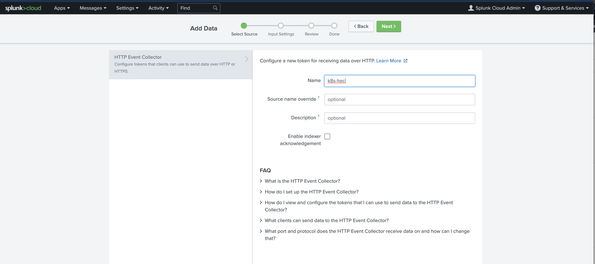

### Create Splunk Http Event Collector (HEC)
The HTTP Event Collector (HEC) is a fast and efficient way to send data  over HTTP (or HTTPS) directly to  Splunk Cloud from your application, Amazon EKS Kubernetes cluster in our case. 

Click Settings > Data Inputs in Splunk Cloud

Click on "Add New" next to HTTP Event Collector

Pick appropriate name such as k8s-hec, leave other fields as default

Pick the clusters we created in the step – em_meta and em_events 

Review and Submit

Copy <Command-C or Ctrl-C> Token Value