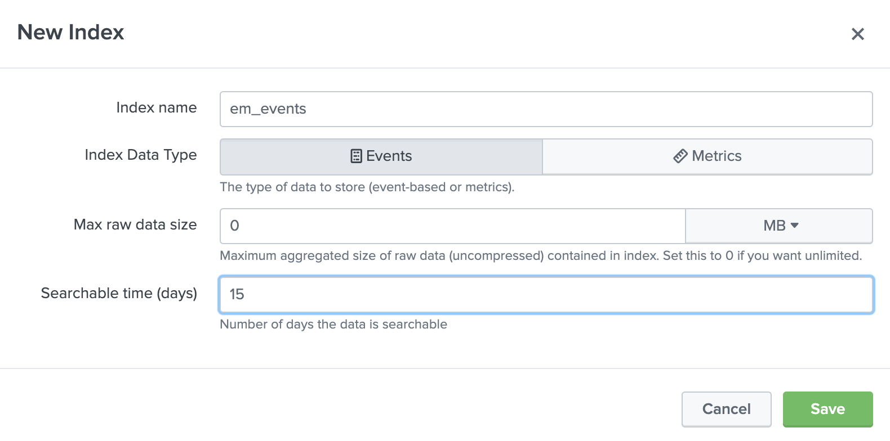

### Creating Splunk Index

The index is the repository for Splunk Enterprise data. Splunk Cloud transforms incoming data into events, which it stores in indexes.

From the home page, Click on Settings and from expanded menu click Indexes

Click New Index with Index Name <b>em_meta</b>. Leave Index Data Type selected as Events. Put 0 in Max raw data size and Searchable time (days) 15. Click Save to create the index.

Following similar steps create another Index with name <b>em_events</>